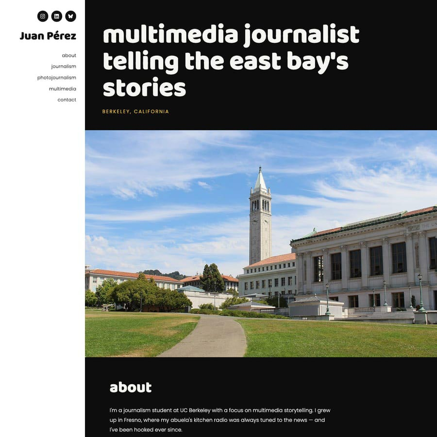
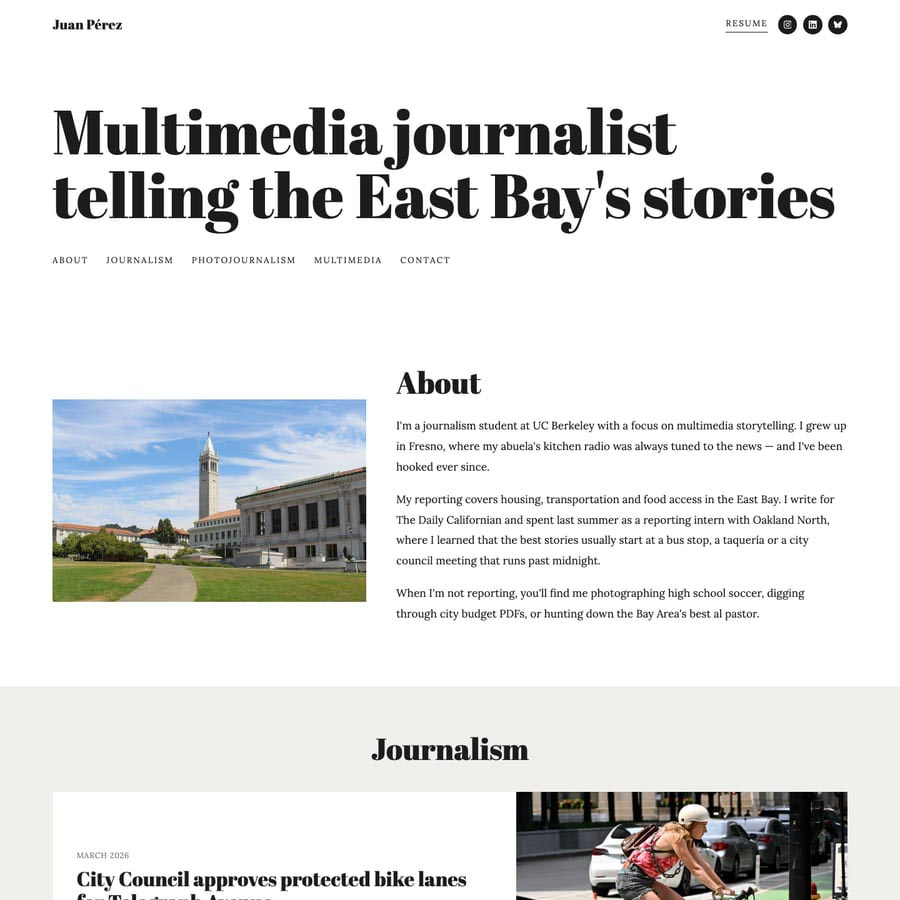
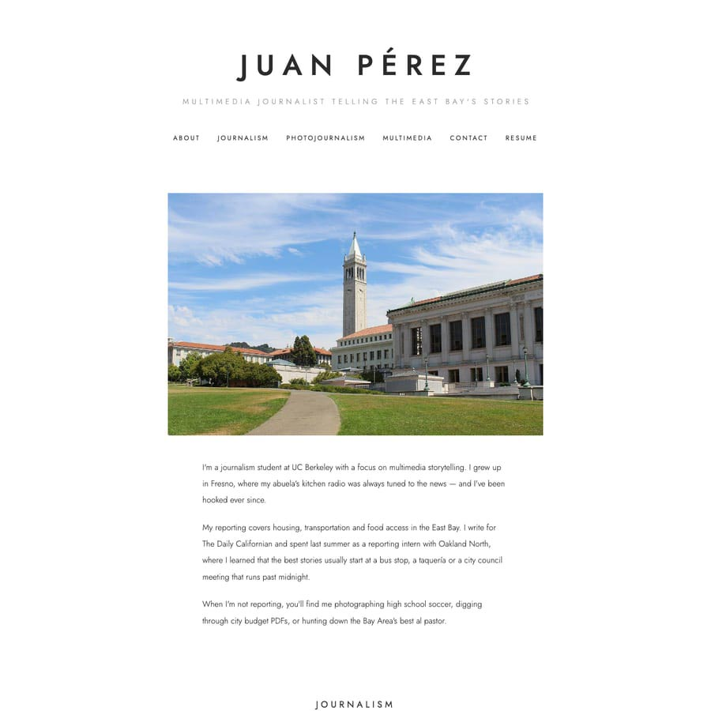
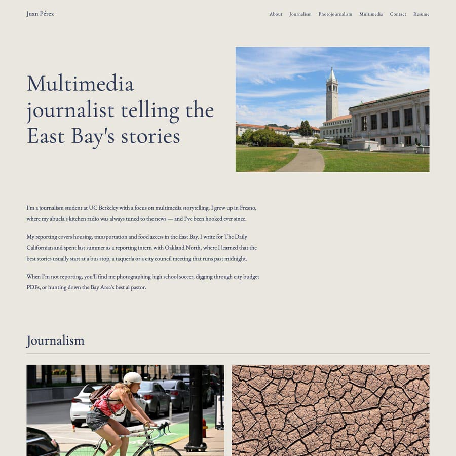
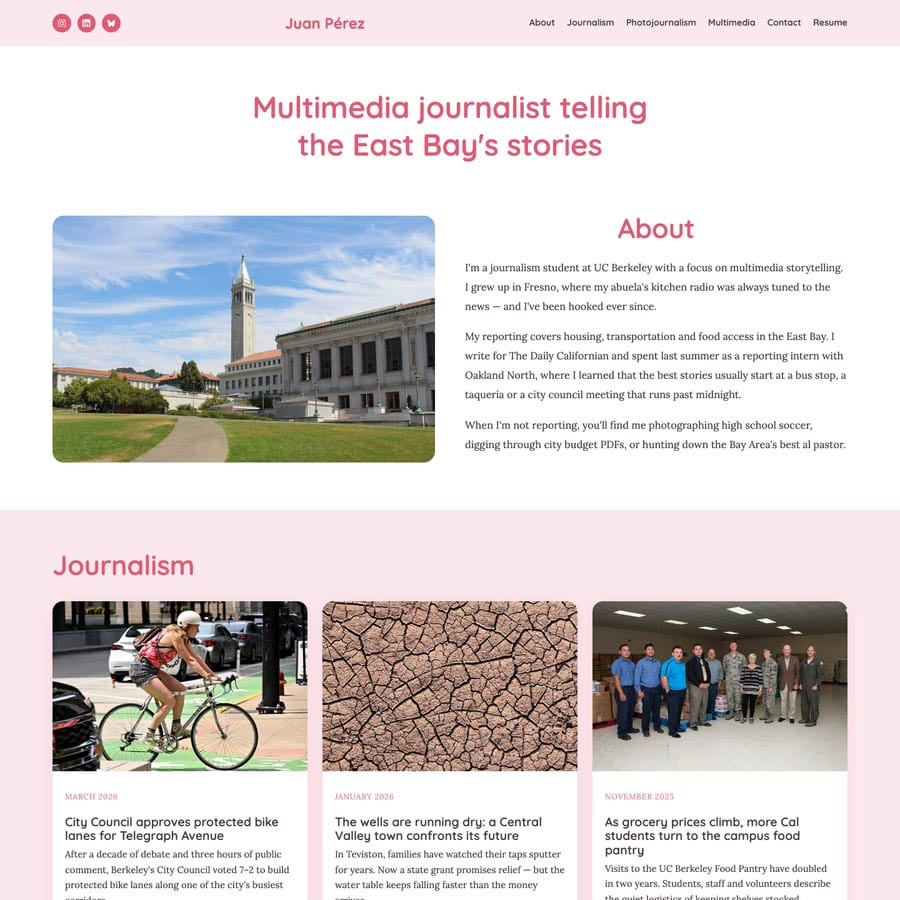
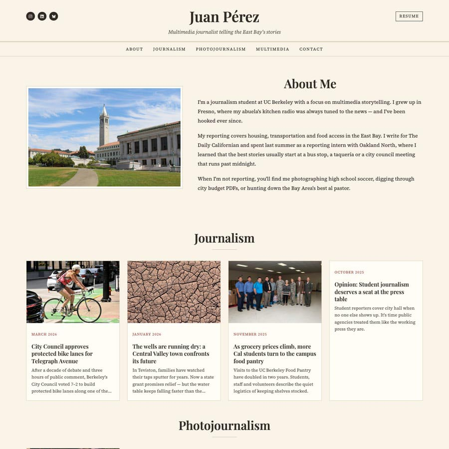
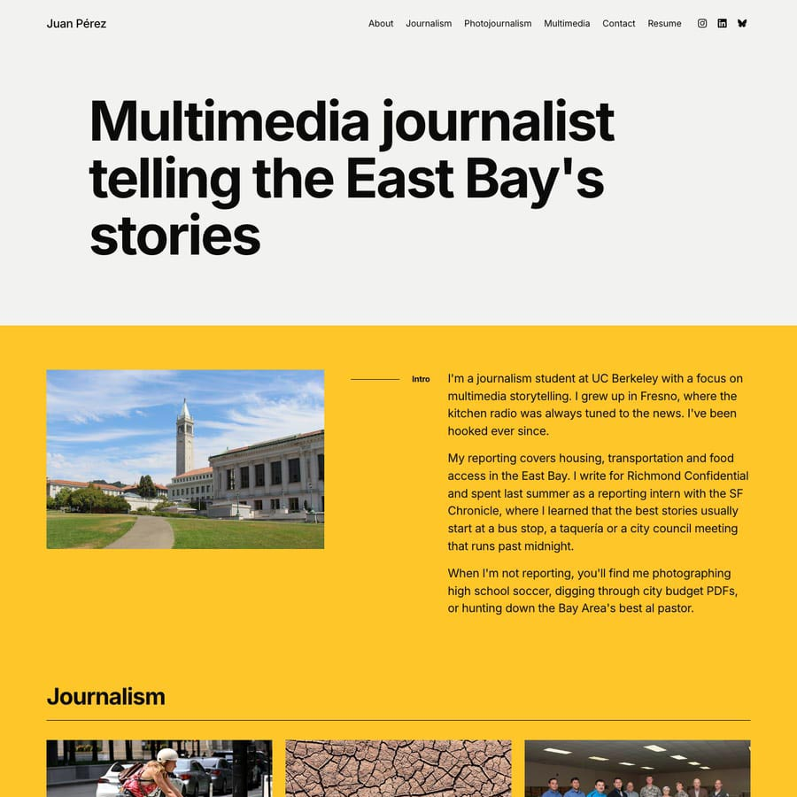
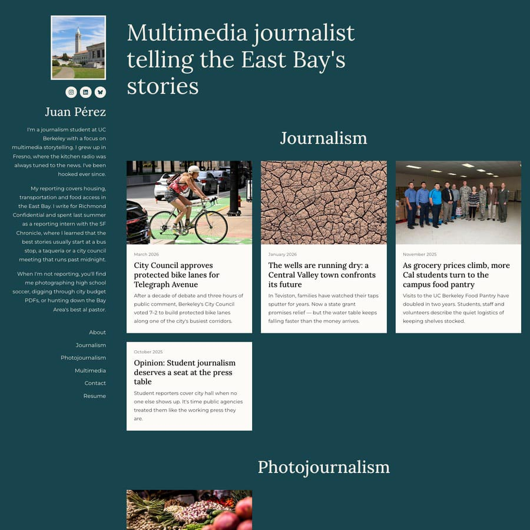

# Personal Portfolio Website

This template builds a professional portfolio website for free, with no
coding required. You fill out **one settings file**, upload your photos, and
GitHub does the rest. Your site will live at:

```
https://YOUR-USERNAME.github.io
```

The site comes pre-filled with a demo portfolio for a fictitious student named
**Juan Pérez** so you can see how everything works. You'll replace his
information with your own.

---

## Getting started (about 10 minutes)

1. **Create a GitHub account** at [github.com](https://github.com) if you don't
   have one. Pick your username carefully — it becomes your web address.

2. **Copy this template.** At the top of this page, click the green
   **"Use this template"** button, then **"Create a new repository."**

3. **Name your repository** exactly like this, using your own username:

   ```
   YOUR-USERNAME.github.io
   ```

   For example, if your username is `jsmith`, name it `jsmith.github.io`.
   (Keep it **Public**, then click **Create repository**.)

4. **Turn on the website.** In your new repository, click **Settings** (top
   menu) → **Pages** (left sidebar). Under **"Build and deployment,"** change
   **Source** to **"GitHub Actions."** That's it — no other settings to touch.

5. **Wait a minute or two.** Click the **Actions** tab. When you see a green
   checkmark ✅, your site is live. Visit `https://YOUR-USERNAME.github.io`
   to see the demo site.

6. **Make it yours.** Open the file **`settings.toml`**, click the ✏️ pencil
   icon to edit it, replace Juan's info with yours, and click
   **"Commit changes."** Every time you commit, the site rebuilds itself
   automatically (give it a minute, then refresh your browser).

---

## Pick your look

Eight designs are included. Change one line in `settings.toml` to switch:

```toml
template = "newsprint"
```

| `marquee` | `editorial` |
|---|---|
| Bold black-and-white with a huge headline and white sidebar | Elegant magazine-style serif type with full-width story rows |
|  |  |

| `byline` | `ivory` |
|---|---|
| Minimal, airy, centered, letterspaced, lots of white space | Soft ivory and navy serif |
|  |  |

| `bloom` | `newsprint` |
|---|---|
| Warm pastel colors, bright and rounded | Classic newspaper look on warm paper |
|  |  |

| `signal` | `harbor` |
|---|---|
| Loud and modern. An oversized bold headline and a saturated color band | Deep teal and bookish, a fixed portrait sidebar and crisp white story cards |
|  |  |

---

## Editing your settings — the full guide

Everything on your site comes from `settings.toml`. Here is every option.
**Only `name` is required.** Skip anything else by leaving it empty (`""`) or
deleting the line, or better yet comment it out by putting a # at the beginning
of the line. This way, you have a note of what it's supposed to look like.

### The golden rules of the settings file

- Text always goes **between quote marks**: `name = "Ada Lovelace"`
- Lines starting with `#` are notes to you — the computer skips them.
- If you need a quote mark *inside* your text, type `\"` instead:
  `tagline = "They call me \"Scoop\""`
- Made a mess? You can always look at this template's original
  [settings.toml](settings.toml) to copy a fresh block.

### About you

```toml
name = "Your Full Name"                 # REQUIRED — appears everywhere
tagline = "Journalist. Photographer."   # Opitonal — short phrase, shown big at the top
location = "Berkeley, California"       # Optional
email = "you@example.com"               # Optional — adds a contact link
phone = "(510) 555-0123"                # Optional
```

### Two settings just for search engines

```toml
job_title = "Multimedia Journalist"   # Optional
employer = "Richmond Confidential"    # Optional
```

Neither of these appears anywhere on your website. Nobody visiting your site
will see them. They are written invisibly into the page so that Google, and
the AI tools that now read the web, can work out who you are, what you do,
and where you do it. See [Being found online](#being-found-online) below.

Fill them in if they describe you. If you are a student without a newsroom
job yet, it is perfectly fine to leave both empty (`""`), or to put your
school as the employer. Do not invent one.

### Social media

Paste any links between the brackets, one per line, each in quotes with a
comma after it. The matching icon (Instagram, LinkedIn, TikTok, YouTube,
Bluesky, X, and 20+ more) appears automatically:

```toml
socials = [
  "https://www.instagram.com/yourhandle",
  "https://www.linkedin.com/in/yourname",
]
```

### Photos and files

```toml
banner_photo = "media/banner.jpg"   # A portrait or wide photo of you
resume = "media/resume.pdf"         # Adds a Resume button (PDF works best)
favicon = ""                        # Browser-tab icon; leave empty and one is
                                    # generated from your initials
```

Upload the actual files to the **`media`** folder — see
[Uploading photos & files](#-uploading-photos--files) below.

### Your bio

Keep the three quote marks (`"""`) on their own lines. A blank line starts a
new paragraph:

```toml
bio = """
First paragraph about you.

Second paragraph about you.
"""
```

### Footer

```toml
footer = "Thanks for reading!"   # Optional extra line at the bottom
```

---

## Adding your portfolio work

Each piece of work is a block that starts with `[[work]]`. Copy an entire
block to add another. Blocks appear on your site in the order they appear in
the file. **Every line is optional** — if you don't have a photo or a link,
just leave that line out and the site adjusts.

### A published story (links out to another website)

```toml
[[work]]
title = "Headline of your story"
description = "A sentence or two about the piece."
url = "https://link-to-your-published-story.com"
image = "media/work/my-thumbnail.jpg"
date = "March 2026"
category = "Journalism"
```

**About `category`:** works with the same category are grouped together under
that heading, and each category gets its own item in the site menu. Use
anything you like — "Journalism," "Photojournalism," "Design," "Podcasts" —
and spell it the same way each time. If you leave it out, the work goes under
a general "Works" heading.

**About `outlet`:** optional, and it does *not* appear on your site. Nobody
reading the page will see it. It records which publication ran the piece, so
search engines can connect this website to your byline wherever else it
appears online. Add it to any work that was published somewhere:

```toml
[[work]]
title = "Headline of your story"
url = "https://link-to-your-published-story.com"
outlet = "The Daily Californian"
```

Leave it out for work you published yourself, like a photo essay or a class
project. Only name an outlet that actually ran the piece.

### A photo essay (hosted right on your site — no link needed)

Clicking it opens a slideshow. Captions go after the `|` symbol and are
optional:

```toml
[[work]]
title = "Saturday at the farmers market"
description = "Scenes from a morning downtown."
date = "February 2026"
category = "Photojournalism"
photos = [
  "media/my-essay/photo1.jpg | First caption here.",
  "media/my-essay/photo2.jpg | Second caption here.",
  "media/my-essay/photo3.jpg",
]
```

### An audio story (hosted right on your site)

Clicking it opens an audio player. The photo is optional:

```toml
[[work]]
title = "My radio piece"
description = "What it's about."
audio = "media/audio/my-piece.mp3"
image = "media/work/optional-photo.jpg"
date = "December 2025"
category = "Multimedia"
```

MP3 files work everywhere. Keep them under ~25 MB.

### A video (uploaded to YouTube or Vimeo)

Upload your video to YouTube or Vimeo first, then paste the link. Clicking
the work plays it in a pop-up on your site:

```toml
[[work]]
title = "My video story"
description = "What it's about."
video = "https://www.youtube.com/watch?v=XXXXXXXX"
date = "September 2025"
category = "Multimedia"
```

---

## Uploading photos & files

All your images, audio and PDFs live in the **`media`** folder.

**To upload:** open the `media` folder on GitHub → click **Add file** →
**Upload files** → drag your files in → **Commit changes**.

Tips:

- Simple file names work best: `bike-story.jpg`, not `IMG_4782 final(2).JPG`.
- Feel free to make sub-folders (like `media/my-essay/`) to stay organized —
  click **Add file → Create new file** and type `media/my-essay/temp.md` to
  create one, or just include the folder name when uploading.
- **Don't worry about photo size.** Giant phone photos are automatically
  resized and compressed when the site builds.
- The sample images in `media` belong to the demo — replace them with your
  own. (Their sources are listed in `media/SAMPLE-MEDIA-CREDITS.md`.)

---

## Being found online

Every page this template builds includes a hidden block of
[schema.org](https://schema.org) data, written in a format called JSON-LD.
You never edit it and visitors never see it. It is assembled automatically
from the settings you have already filled in.

What it does is tell search engines, and the AI assistants that now answer
questions about people, three things:

1. **Who you are.** Your name, your one-line description, your photo, your
   job title and employer if you added them.
2. **Where else you are.** Every link in your `socials` list is published as
   part of your identity. This is the important one. It is how a search
   engine learns that the person behind this website, the person on that
   LinkedIn profile, and the byline on that story are all the same person.
3. **What you have made.** Every `[[work]]` entry, listed with its headline,
   its date, its outlet if you gave one, and you named as the author.

A few things worth knowing:

- Filling in `socials` does more for this than anything else you can do.
- Dates are converted automatically when they can be understood. "March 2026"
  and "3/15/2026" both work. Something vague like "Fall 2025" is skipped, and
  that is fine. It still appears normally on your site.
- Nothing is invented. Any setting you leave blank is simply left out.
- **Keep it honest.** This block is a claim about your identity and your
  authorship, published in a form that machines act on. It deserves the same
  care as a byline. Do not list an outlet that did not run your work, and do
  not claim a job you do not hold.

To see what your site is publishing, paste your web address into Google's
[Rich Results Test](https://search.google.com/test/rich-results) or the
[Schema Markup Validator](https://validator.schema.org). Be patient about
results. This will not push you up the rankings overnight. What it does is
make sure that when someone or something does look you up, it finds the right
person.

---

## Optional: colors and fonts

Every template already comes with matching colors and fonts. To customize,
fill in the section at the bottom of `settings.toml`:

```toml
[colors]
accent = "#c9401a"       # Links, highlights, headings (varies by template)
background = "#fffdf5"   # The page background
text = "#222222"         # The main text color

[fonts]
heading = "Playfair Display"   # Any font name from fonts.google.com
body = "Lora"
```

Find color codes at [htmlcolorcodes.com](https://htmlcolorcodes.com) and
browse fonts at [fonts.google.com](https://fonts.google.com). Leave any of
these empty (`""`) to keep the template's own choice.

---

## When something goes wrong

**My site didn't update.** Give it two minutes and hard-refresh your browser
(Cmd+Shift+R on Mac, Ctrl+Shift+R on Windows). Still nothing? Check the
**Actions** tab.

**There's a red ❌ in the Actions tab.** Something in `settings.toml` has a
formatting mistake. Click the failed run, then click **build** — you'll find
a plain-English message telling you which line to fix. The usual suspects:

- A missing quote mark somewhere
- A missing comma between items in a list
- A `[[work]]` line missing one of its brackets

**A photo isn't showing.** Check that the file name in `settings.toml`
matches the real file name in `media` exactly. The site forgives
UPPERCASE/lowercase differences, but not misspellings.

**My video won't play.** Make sure it's a normal YouTube or Vimeo link, and
that the video isn't set to Private. ("Unlisted" works fine.)

---

## Advanced Users: preview on your own computer

Adventurous? You can set this up locally on your own machine so you instantly 
see changes. When they look good to you, you can then push them to Github.

1. Install [Node JS](https://nodejs.org/en)
2. Install [VS Code](https://code.visualstudio.com/download)
3. Optional but recommended, install [Github Desktop](https://desktop.github.com/download/)

Clone your repository to your local computer, then open the folder in VS Code. 

In VS Code, open the terminal (Terminal -> New Terminal) and run the following commands.

```bash
npm install
npm run dev
```

Then open http://localhost:3000. The preview reloads itself every time you
save `settings.toml` or add files to `media`.

Advanced users can add additional templates. See:
[generator/EXTENDING.md](generator/EXTENDING.md).

---

## Credits

Built with [Bootstrap's grid](https://getbootstrap.com),
[Google Fonts](https://fonts.google.com),
[Nunjucks](https://mozilla.github.io/nunjucks/) and
[simple-icons](https://simpleicons.org). Sample photos and audio are public
domain / Creative Commons — see `media/SAMPLE-MEDIA-CREDITS.md`.

Made by Jeremy Sanchez Rue
with assistance from various AI tools.
